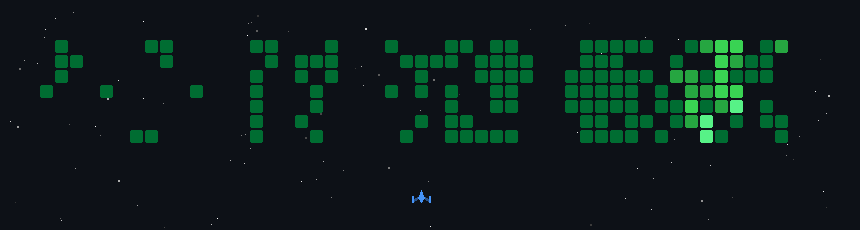
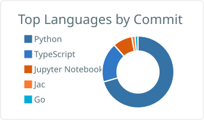
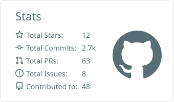
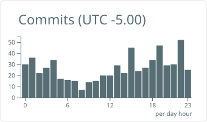

# Phong Cao

<picture>
  <source media="(prefers-color-scheme: dark)" srcset="https://readme-typing-svg.demolab.com?font=Fira+Code&weight=600&size=22&duration=2800&pause=800&color=C084FC&center=true&vCenter=true&width=460&lines=ML+Infrastructure;LLM+Systems;Agent+Tooling;On-Device+Inference">
  
</picture>

I build the machinery around models — distributed training, on-device inference, agent tool infrastructure, and evaluation systems that catch hallucinations before users do.

M.S. Artificial Intelligence @ WPI '27 · building <a href="https://github.com/Zolli-Labs">Zolli Labs</a>

 

<samp>this profile runs like an ML system &nbsp;·&nbsp; 01 TRAIN → 02 EVAL → 03 SHIP → 04 MONITOR &nbsp;·&nbsp; fully automated by GitHub Actions</samp>

## 🗳 <samp>01 TRAIN // TEACH A REAL AGENT — YOUR VOTE BECOMES WEIGHTS</samp>

  

  <b>not an animation — a real model.</b> a tiny policy is learning this level from visitor votes: it dies, you tell it what it should have done, and every sunday CI trains it and <b>commits new weights</b>. <b>one click below opens a ready-made ballot — just press submit.</b> CI counts your vote in ~30s and the card updates.

  
  
  
  
  &nbsp;
  

## 🕹️ <samp>02 EVAL // MY COMMITS UNDER FIRE</samp>

  

  every enemy block is one of my real commits — the ship re-fights this battle daily via GitHub Actions

## 🚀 <samp>03 SHIP // TOP SYSTEMS</samp>

<table>
  <tr>
    <td width="33%" valign="top">
      <h4 align="center"><a href="https://github.com/Zolli-Labs/flashml">FlashML</a></h4>
      
⚡ Fault-tolerant distributed ML runtime — training jobs survive the machine being destroyed. Core of <a href="https://github.com/Zolli-Labs">Zolli Labs</a>.

      
  

    </td>
    <td width="33%" valign="top">
      <h4 align="center"><a href="https://github.com/PhongCT1105/On-Device-Real-Estate-Assistant">On-Device Assistant</a></h4>
      
📱 FLAN-T5 → ONNX on Android ARM64 — a QA transformer in your pocket, quantized without wrecking answers.

      
  

    </td>
    <td width="33%" valign="top">
      <h4 align="center"><a href="https://github.com/PhongCT1105/Hack-Research">LLM Hallucination Study</a></h4>
      
🧪 360-claim factorial study — grounding drops severe LLM fabrications from <b>34%</b> to <b>0%</b>.

      
  

    </td>
  </tr>
  <tr>
    <td width="33%" valign="top">
      <h4 align="center"><a href="https://github.com/PhongCT1105/transfer-learning-ad-mri-depression-classification">Brain MRI Transfer Learning</a></h4>
      
🧠 Alzheimer's &amp; depression classification from brain MRI scans with domain-adapted vision models.

      
  

    </td>
    <td width="33%" valign="top">
      <h4 align="center"><a href="https://github.com/PhongCT1105/neetcode-gpt">neetcode-gpt</a></h4>
      
🔩 A working GPT assembled from self-implemented parts — BPE, grouped-query attention, KV cache, training loops.

      
  

    </td>
    <td width="33%" valign="top">
      <h4 align="center"><a href="https://github.com/PhongCT1105/Repo2Resume">Repo2Resume</a></h4>
      
🚀 Turns GitHub repositories into STAR-method resume bullets and tailored cover letters. GoatHacks winner.

      
  

    </td>
  </tr>
</table>

  

  🔒 also in the lab: REU 2025 · Murai Lab — research in progress (repo private)

<b>🏆 <samp>BENCHMARKS // HACKATHON RECORD</samp></b>

 

| | Event | Build |
|---|---|---|
| 🏆 | Runpod Flash Hackday '26 | [FlashML](https://github.com/PhongCT1105/FlashML) — distributed ML engine, later grew into the Zolli Labs runtime |
| 🏆 | Berkeley AI Hackathon '26 | [AI Hack Berkeley build](https://github.com/PhongCT1105/AI_Hack_Berkeley) |
| 🏆 | BetaFund × Stanford Hack | Cortex — team project (repo lives on a teammate's account) |
| 🏆 | HackResearch '26 | [LLM Hallucination Study](https://github.com/PhongCT1105/Hack-Research) — started as a hackathon win |
| 🏆 | GoatHacks '25 | [Repo2Resume](https://github.com/PhongCT1105/Repo2Resume) — GitHub repos → STAR-method resume bullets |
| 🏆 | NASA Space Apps Challenge '25 | [Space Apps build](https://github.com/PhongCT1105/NASA_Space_App_Challenge) |
| ⚙️ | YC Hackathon '26 | [YC_Hack](https://github.com/PhongCT1105/YC_Hack) |
| ⚙️ | Okta × Stripe Hack '26 | [okta_stripe_hack](https://github.com/PhongCT1105/okta_stripe_hack) |
| ⚙️ | Gen UI Hack '26 | [Gen_UI_Hack](https://github.com/PhongCT1105/Gen_UI_Hack) |
| ⚙️ | Vortex Harness Engineering Hack '26 | [Vortex-Harness](https://github.com/PhongCT1105/Vortex-Harness-Engineering-Hack-) |
| ⚙️ | AI for Education Hackathon '26 | [AI-for-Education](https://github.com/PhongCT1105/AI-for-Education-Hackathon) |
| ⚙️ | BrightData Hack '26 | [BrightData](https://github.com/PhongCT1105/BrightData) |

<b>🗄 <samp>MORE SYSTEMS</samp></b>

 

- **[SyntheSearch](https://github.com/PhongCT1105/SyntheSearch)** — AI research tool that finds and synthesizes the most relevant papers
- **[On_Device_Deep_Learning](https://github.com/PhongCT1105/On_Device_Deep_Learning)** — deep learning benchmarks on phone hardware
- **[RecSys_MAG](https://github.com/PhongCT1105/RecSys_MAG)** — recommender-system experiments on academic graph data

## 📊 <samp>04 MONITOR // LIVE TELEMETRY</samp>

<table>
  <tr>
    <td width="33%" align="center">
      <picture>
        <source media="(prefers-color-scheme: dark)" srcset="profile-summary-card-output/tokyonight/2-most-commit-language.svg">
        
      </picture>
    </td>
    <td width="33%" align="center">
      <picture>
        <source media="(prefers-color-scheme: dark)" srcset="profile-summary-card-output/tokyonight/3-stats.svg">
        
      </picture>
    </td>
    <td width="33%" align="center">
      <picture>
        <source media="(prefers-color-scheme: dark)" srcset="profile-summary-card-output/tokyonight/4-productive-time.svg">
        
      </picture>
    </td>
  </tr>
</table>

  all telemetry regenerates itself daily — this profile is a running system, not a static page

## 🛠 <samp>STACK</samp>

`PyTorch` · `ONNX Runtime` · `Python` · `TypeScript / React` · `FastAPI` · `PostgreSQL` · `Docker` · `AWS` · `Runpod` · `MCP`

## 📡 <samp>CONTACT</samp>

