<!-- Variant 01 — Terminal / Systems · part of the readme-redesign branch · see ../README.md for the index -->

<p align="center">
  
</p>

<p align="center">
  
</p>

## `❯ whoami`

```text
Phong Cao — software engineer who builds ML/AI systems.
B.S. Computer Science + M.S. Artificial Intelligence @ WPI (2027).
I care about the layer where models meet real infrastructure:
distributed training, on-device inference, agent tooling, and evaluation.
```

## `❯ cat focus.txt`

| | |
|---|---|
| `distributed-ml/` | Serverless distributed training — MapReduce, parameter servers, parallel search |
| `on-device/` | Exporting and quantizing transformer models to run on phones |
| `agents/` | Tool routing and control planes for MCP-based agent systems |
| `evaluation/` | Measuring LLM hallucination and grounding at the claim level |

## `❯ ls stack/ --high-signal`

```text
python/     pytorch · onnx-runtime · fastapi · numpy
typescript/ react · node
ml-infra/   runpod-flash · docker · aws · postgresql
concepts/   distributed-training · quantization · rag · mcp
```

## `❯ ls projects/ --featured`

### `flashml/` — [FlashML](https://github.com/PhongCT1105/FlashML)

```text
$ flashml describe
Serverless distributed ML engine on Runpod Flash. Runs three distributed
architectures on real workers and makes the execution visible:
  · MapReduce            → K-Means (shard → partial sums → reduce → broadcast)
  · Gradient Sync        → linear regression via a parameter server
  · Embarrassingly ∥     → hyperparameter search with a live leaderboard
stack: TypeScript · Python · React Flow · Runpod Flash
```

### `harbor/` — [Harbor](https://github.com/PhongCT1105/Harbor)

```text
$ harbor describe
Control plane for MCP servers: discovers, indexes and routes thousands of
MCP tools so the LLM only sees the ones it needs — smaller context,
better tool-calling accuracy.
stack: MCP · embeddings-based tool ranking · runtime routing
```

### `on-device-assistant/` — [On-Device Real-Estate Assistant](https://github.com/PhongCT1105/On-Device-Real-Estate-Assistant)

```text
$ ondevice describe
Domain-tuned FLAN-T5 QA model exported to ONNX and benchmarked on
Android ARM64 — comparing optimization strategies for answer quality
vs on-phone efficiency, with a packaged Android inference path.
stack: PyTorch · ONNX Runtime · Android · Whisper
```

### `hallucination-study/` — [Recipient-Focused Hallucinations in LLM Outreach](https://github.com/PhongCT1105/Hack-Research)

```text
$ study describe
Claim-level factorial study (96 emails · 360 claims · 12 professors):
ungrounded LLMs fabricate research claims 34% of the time; grounding
with real publications drops severe errors to 0% and doubles specificity.
stack: LLM-as-judge + human validation · factorial eval design
```

### `neetcode-gpt/` — [GPT from scratch](https://github.com/PhongCT1105/neetcode-gpt)

```text
$ gpt describe
A working GPT assembled from components I implemented individually:
BPE tokenizer, self-attention, multi-head + grouped-query attention,
KV cache, layer/RMS norm, training loop, generation.
stack: Python · PyTorch
```

## `❯ git log --activity`

<p align="center">
  
</p>

<p align="center">
  
</p>

## `❯ contact --open`

```text
github    → https://github.com/PhongCT1105
linkedin  → https://www.linkedin.com/in/phongct1105
email     → phongct1105@gmail.com
status    → open to 2027 new-grad SWE / ML / AI roles
```

<p align="center">
  
</p>
