<!-- Variant 02 — Minimal Dark / Recruiter Dashboard · part of the readme-redesign branch · see ../README.md for the index -->

  

  

### Featured Engineering Work

<table width="100%">
<tr>
<td width="50%" valign="top">

**[FlashML](https://github.com/PhongCT1105/FlashML)** · ML Infrastructure

Serverless distributed ML engine that runs MapReduce K-Means, parameter-server gradient sync, and embarrassingly-parallel hyperparameter search on real Runpod Flash workers — with the execution graph visualized live.

`TypeScript` `Python` `Runpod Flash` `React Flow`

</td>
<td width="50%" valign="top">

**[Harbor](https://github.com/PhongCT1105/Harbor)** · Agent Infrastructure

Control plane for MCP servers: discovers, indexes, ranks and routes thousands of MCP tools so an LLM sees only what it needs — reducing context size and improving tool-calling accuracy.

`MCP` `Tool Routing` `Embeddings`

</td>
</tr>
<tr>
<td width="50%" valign="top">

**[On-Device Real-Estate Assistant](https://github.com/PhongCT1105/On-Device-Real-Estate-Assistant)** · On-Device AI

Domain-tuned FLAN-T5 exported to ONNX and benchmarked on Android ARM64 — comparing quantization/optimization strategies on answer quality vs on-phone efficiency, packaged as a runnable Android app.

`PyTorch` `ONNX Runtime` `Android`

</td>
<td width="50%" valign="top">

**[LLM Hallucination Study](https://github.com/PhongCT1105/Hack-Research)** · AI Evaluation

Claim-level factorial study of AI-generated outreach (96 emails, 360 claims): ungrounded LLMs fabricate claims about real researchers 34% of the time; grounding cuts severe errors to 0% while doubling specificity.

`LLM-as-Judge` `Human Validation` `Experiment Design`

</td>
</tr>
<tr>
<td width="50%" valign="top">

**[GPT from Scratch](https://github.com/PhongCT1105/neetcode-gpt)** · ML Fundamentals

A working GPT assembled from components implemented individually — BPE tokenizer, multi-head and grouped-query attention, KV cache, normalization layers, training loop and generation.

`Python` `PyTorch`

</td>
<td width="50%" valign="top">

**[Hospital Management Platform](https://github.com/PhongCT1105/Web-application-for-Mass-General-Brigham-Hospital)** · Full-Stack SWE

Web platform for Brigham & Women's Hospital built with a 11-person team: interactive map with A*/BFS/DFS/Dijkstra pathfinding, service-request workflows, map editor, and role-based admin tooling.

`TypeScript` `React` `Node` `PostgreSQL`

</td>
</tr>
</table>

### Technical Focus

**ML Infrastructure** — distributed training patterns, serverless GPU workers, benchmark tooling
**AI Engineering** — RAG, agent tool-routing (MCP), LLM evaluation with claim-level grounding
**Systems & Full-Stack** — TypeScript/React products, Python services, PostgreSQL, AWS

### Activity

  
  

### Contact

[GitHub](https://github.com/PhongCT1105) · [LinkedIn](https://www.linkedin.com/in/phongct1105) · [phongct1105@gmail.com](mailto:phongct1105@gmail.com)

  

