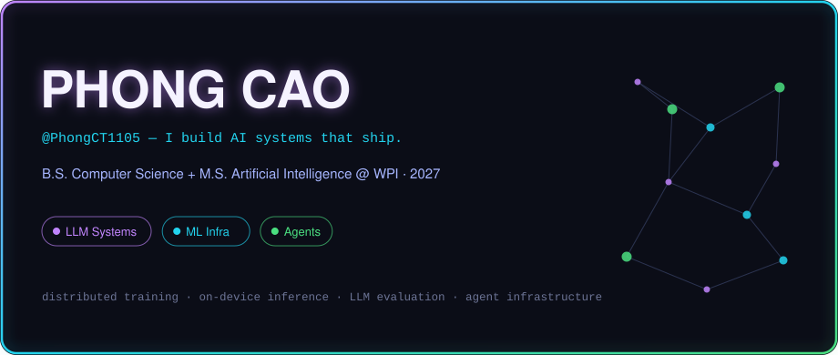

<!-- Variant 03 — Neon Glow / AI Builder · part of the readme-redesign branch · see ../README.md for the index -->

  

  

## ⚡ What I Build

I build the machinery around models — the part that makes AI actually usable:
**distributed training engines**, **on-device inference pipelines**, **agent tool infrastructure**, and **evaluation systems that catch hallucinations before users do**.

## 🚀 Flagship Projects

### [FlashML](https://github.com/PhongCT1105/FlashML) &nbsp; 

> **Distributed ML you can watch.** A serverless playground on Runpod Flash that runs three real distributed architectures — MapReduce K-Means, parameter-server gradient sync, and embarrassingly-parallel hyperparameter search — on live workers, with the execution graph animating in React Flow.

  

### [Harbor](https://github.com/PhongCT1105/Harbor) &nbsp; 

> **The control plane for MCP servers.** Discovers, indexes, ranks and routes thousands of MCP tools so the model only sees the right ones — smaller context, sharper tool calls, one runtime for OpenAI, Anthropic, Gemini or Ollama clients.

  

### [On-Device Real-Estate Assistant](https://github.com/PhongCT1105/On-Device-Real-Estate-Assistant)

> **A transformer in your pocket.** Domain-tuned FLAN-T5 exported to ONNX and benchmarked on Android ARM64 — measuring how far quantization and optimization can push a QA model on phone hardware without wrecking answer quality.

  

## 🧪 Research & Experiments

**[LLM Hallucination Study](https://github.com/PhongCT1105/Hack-Research)** — a claim-level factorial study of AI-generated professor outreach (96 emails · 360 claims · 12 researchers). Headline: ungrounded LLMs fabricate claims **34%** of the time; grounding with real publications drops severe errors to **0%** and doubles supported specificity.

**[GPT from scratch](https://github.com/PhongCT1105/neetcode-gpt)** — a working GPT assembled entirely from self-implemented parts: BPE tokenizer, multi-head + grouped-query attention, KV cache, RMS/layer norm, training and generation loops.

## 🛠 AI/ML Systems Stack

`PyTorch` · `ONNX Runtime` · `Python` · `TypeScript / React` · `FastAPI` · `PostgreSQL` · `Docker` · `AWS` · `Runpod Flash` · `MCP`

## 📡 Signal

  
  

## 🔗 Links

  

