<!-- Variant 04 — Clean Professional / Research + Engineering · part of the readme-redesign branch · see ../README.md for the index -->

  <picture>
    <source media="(prefers-color-scheme: dark)" srcset="../../assets/clean/hero-dark.svg">
    <source media="(prefers-color-scheme: light)" srcset="../../assets/clean/hero-light.svg">
    
  </picture>

I work at the layer where machine learning meets real infrastructure: making distributed training visible and cheap, getting transformer models to run on phones, routing tools for LLM agents, and measuring — precisely — when language models fabricate.

---

### Selected Work

**1 · [FlashML](https://github.com/PhongCT1105/FlashML)** — *Distributed engine for machine learning*

A serverless distributed ML playground on Runpod Flash. It runs three canonical distributed architectures on real workers — MapReduce (K-Means), parameter-server gradient synchronization (linear regression), and embarrassingly-parallel hyperparameter search — and renders the execution graph live, so the infrastructure that ML demos usually hide becomes the interface. *TypeScript, Python, React Flow.*

**2 · [On-Device Real-Estate Assistant](https://github.com/PhongCT1105/On-Device-Real-Estate-Assistant)** — *Transformer inference on phone hardware*

A domain-tuned FLAN-T5 question-answering model exported to ONNX and packaged for Android ARM64, with a reproducible benchmark suite comparing optimization strategies on both answer quality and device efficiency. Team project at WPI. *PyTorch, ONNX Runtime, Android.*

**3 · [Recipient-Focused Hallucinations in LLM Outreach](https://github.com/PhongCT1105/Hack-Research)** — *Claim-level evaluation study*

A 2×2 factorial study of whether grounding and verification stop LLMs from misrepresenting real researchers, measured at the level of individual claims (96 emails, 360 claims, 12 professors, human-validated). Ungrounded models fabricated claims 34% of the time; grounding eliminated severe errors entirely while doubling supported specificity. *NSRI Summer Research Hackathon 2026.*

**4 · [Harbor](https://github.com/PhongCT1105/Harbor)** — *Control plane for MCP servers*

Runtime that discovers, indexes, ranks and routes MCP tools so an LLM client sees only the relevant subset — reducing context size and improving tool-calling accuracy across OpenAI, Anthropic, Gemini and Ollama clients.

---

### Technologies

Python · PyTorch · ONNX Runtime · TypeScript · React · Node.js · FastAPI · PostgreSQL · Docker · AWS

### Foundations

A working GPT built from scratch — tokenizer, attention variants, KV cache, training loop — lives in [neetcode-gpt](https://github.com/PhongCT1105/neetcode-gpt). Earlier full-stack work includes a [hospital management platform](https://github.com/PhongCT1105/Web-application-for-Mass-General-Brigham-Hospital) built with an 11-person team (interactive pathfinding, service workflows, admin tooling).

### Activity

  <picture>
    <source media="(prefers-color-scheme: dark)" srcset="https://github-readme-stats.vercel.app/api?username=PhongCT1105&show_icons=true&hide_border=true&theme=github_dark&bg_color=0d1117">
    <source media="(prefers-color-scheme: light)" srcset="https://github-readme-stats.vercel.app/api?username=PhongCT1105&show_icons=true&hide_border=true&bg_color=ffffff&title_color=2563eb&icon_color=2563eb&text_color=111827">
    
  </picture>
  <picture>
    <source media="(prefers-color-scheme: dark)" srcset="https://github-readme-stats.vercel.app/api/top-langs/?username=PhongCT1105&layout=compact&hide_border=true&theme=github_dark&bg_color=0d1117&langs_count=6">
    <source media="(prefers-color-scheme: light)" srcset="https://github-readme-stats.vercel.app/api/top-langs/?username=PhongCT1105&layout=compact&hide_border=true&bg_color=ffffff&title_color=2563eb&text_color=111827&langs_count=6">
    
  </picture>

### Contact

Worcester, MA · [github.com/PhongCT1105](https://github.com/PhongCT1105) · [linkedin.com/in/phongct1105](https://www.linkedin.com/in/phongct1105) · [phongct1105@gmail.com](mailto:phongct1105@gmail.com)
